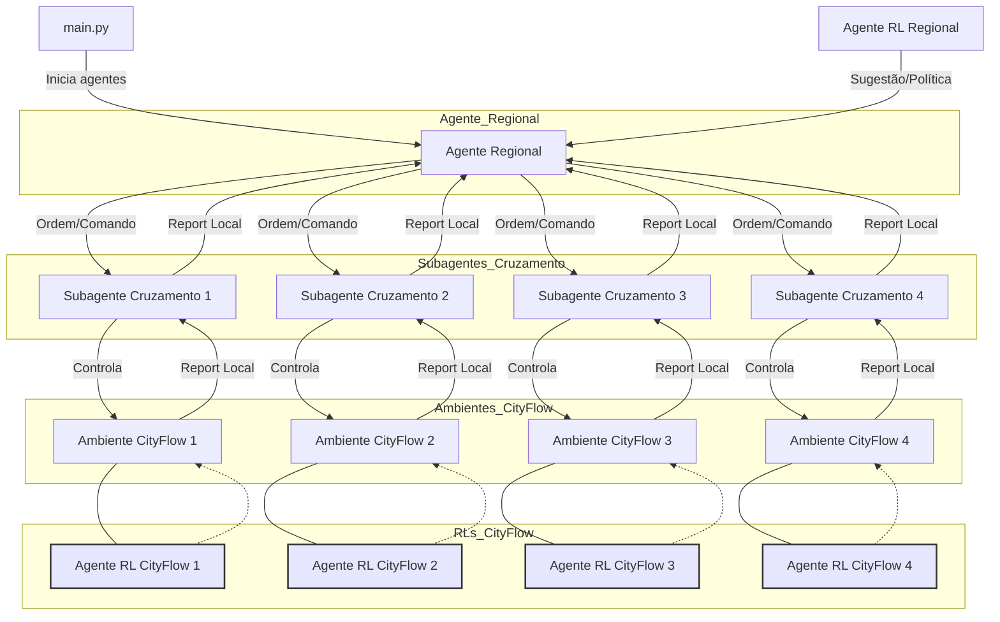

```mermaid
graph TD
    SUP[main.py]
    RL_REG[Agente RL Regional]
    subgraph Agente_Regional
        REG[Agente Regional]
    end
    subgraph Subagentes_Cruzamento
        SUB1[Subagente Cruzamento 1]
        SUB2[Subagente Cruzamento 2]
        SUB3[Subagente Cruzamento 3]
        SUB4[Subagente Cruzamento 4]
    end
    subgraph Ambientes_CityFlow
        CF1[Ambiente CityFlow 1]
        CF2[Ambiente CityFlow 2]
        CF3[Ambiente CityFlow 3]
        CF4[Ambiente CityFlow 4]
    end
    subgraph RLs_CityFlow
        RL1[Agente RL CityFlow 1]
        RL2[Agente RL CityFlow 2]
        RL3[Agente RL CityFlow 3]
        RL4[Agente RL CityFlow 4]
    end

    SUP -- "Inicia agentes" --> REG
    REG -- "Ordem/Comando" --> SUB1
    REG -- "Ordem/Comando" --> SUB2
    REG -- "Ordem/Comando" --> SUB3
    REG -- "Ordem/Comando" --> SUB4

    SUB1 -- "Report Local" --> REG
    SUB2 -- "Report Local" --> REG
    SUB3 -- "Report Local" --> REG
    SUB4 -- "Report Local" --> REG

    SUB1 -- "Controla" --> CF1
    CF1 -- "Report Local" --> SUB1
    SUB2 -- "Controla" --> CF2
    CF2 -- "Report Local" --> SUB2
    SUB3 -- "Controla" --> CF3
    CF3 -- "Report Local" --> SUB3
    SUB4 -- "Controla" --> CF4
    CF4 -- "Report Local" --> SUB4

    RL_REG -- "Sugestão/Política" --> REG

    CF1 --- RL1
    CF2 --- RL2
    CF3 --- RL3
    CF4 --- RL4

    RL1 -.-> CF1
    RL2 -.-> CF2
    RL3 -.-> CF3
    RL4 -.-> CF4

    style RL1 fill:#e6e6ff,stroke:#333,stroke-width:2
    style RL2 fill:#e6e6ff,stroke:#333,stroke-width:2
    style RL3 fill:#e6e6ff,stroke:#333,stroke-width:2
    style RL4 fill:#e6e6ff,stroke:#333,stroke-width:2
```